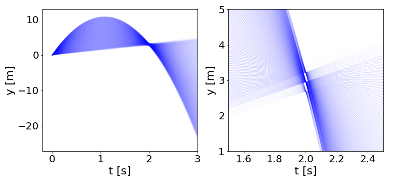
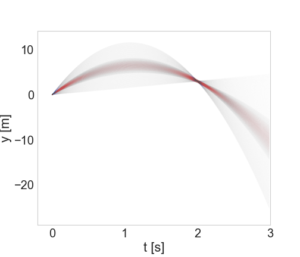

Technical Background
====================

This page includes some references about Bayes' Theorem and Bayesian inference and discusses the particulars of the implementation of these ideas within ``bayesim``.

Bayes' Theorem
--------------

There are a `plethora <https://brohrer.github.io/how_bayesian_inference_works.html>`_ of `great <https://brilliant.org/wiki/bayes-theorem/>`_ `explanations <https://betterexplained.com/articles/an-intuitive-and-short-explanation-of-bayes-theorem/>`_ of Bayes' Theorem out there already, so I won't go through all the bayesics here but instead refer you to one of those linked above or any number of others you can find online or in a textbook.

Assuming you understand Bayes' Theorem to your own satisfaction at this point, let's remind ourselves of some **terminology**.

.. math:: \color{firebrick} {P(H|E)} =
 \frac{\color{darkorange} {P(H)}
 \color{darkmagenta} {P(E|H)}}
 {\color{teal} {P(E)}}

The :math:`\color{firebrick}{\mathbf{\text{posterior probability}}}` of our hypothesis :math:`H` given observed evidence :math:`E` is the result of a Bayesian update to the :math:`\color{darkorange}{\mathbf{\text{prior}}}` estimate of the probability of :math:`H` given the :math:`\color{darkmagenta}{\mathbf{\text{likelihood}}}` of observing :math:`E` in a world where :math:`H` is true and the probability of observing our :math:`\color{teal}{\mathbf{\text{evidence}}}` in the first place.

Bayesian Inference and Parameter Estimation
-------------------------------------------

.. note::
  I haven't found an online explanation of this material at a not-excessively-mathy level (I firmly believe that you don't need a lot of knowledge of mathematical terminology to understand this; it can really be done in a very visual way) so I wrote my own. If you know of another, please `send it to me <rkurchin@mit.edu>`_ and I'd be happy to link to it here!

  **Update!!** I found some nice explanations/examples in `this repo <https://github.com/jakevdp/BayesianAstronomy>`_! Check them out for some more material in addition to what I've included here.

Most of the examples used to explain Bayes' Theorem have two hypotheses to disginguish between (e.g. "is it raining?": yes or no). However, to use Bayes' Theorem for *parameter estimation*, which is the problem of interest here, we need to generalize to many more than two hypotheses, and those hypotheses may be about the values of multiple different parameters. In addition, we would like to incorporate many pieces of evidence, necessitating many iterations of the Bayesian calculation. These and other factors can make it confusing to conceptualize how to generalize the types of computations we do to estimate the probability of the answer to a yes-or-no question or a dice roll to a problem statement relevant to a more general scientific/modeling inquiry. I will walk through these factors here.

Many hypotheses, in multiple dimensions
^^^^^^^^^^^^^^^^^^^^^^^^^^^^^^^^^^^^^^^

The first step is let our hypotheses :math:`H` range over more than two values. That is, rather than having :math:`H_1` = "yes, it is raining" and :math:`H_2` = "no, it is not raining", we would instead have something like :math:`H_1` = "the value of parameter :math:`A` is :math:`a_1`", :math:`H_2` = "the value of parameter :math:`A` is :math:`a_2`", etc. for as many :math:`a_n` as we wanted to consider. While we could then in principle enumerate many different statements of Bayes' Theorem of the form

.. math::

  \begin{eqnarray}
  P(A=a_1|E) &=& \frac{P(A=a_1)P(E|A=a_1)}{P(E)} \\
  P(A=a_2|E) &=& \frac{P(A=a_2)P(E|A=a_2)}{P(E)} \\
  &...& \\
  P(A=a_n|E) &=& \frac{P(A=a_n)P(E|A=A_n)}{P(E)}
  \end{eqnarray},

this is quite cumbersome and so instead we will write

.. math:: P(A|E) = \frac{P(A)P(E|A)}{P(E)}

with the understanding that this probability is not a single value but rather a function over all possible values of :math:`A`. This also allows the number of equations we have to write not to explode when we want to add another fitting parameter, and instead the probability function just to be defined over an additional dimension:

.. math:: P(A,B|E) = \frac{P(A,B)P(E|A,B)}{P(E)}

Iterative Bayesian updates
^^^^^^^^^^^^^^^^^^^^^^^^^^

The next step is to reframe Bayes' Theorem as an explicitly iterative procedure. Imagine we've incorporated one piece of evidence :math:`E_1`, resulting in a posterior probability :math:`P(H|E_1)`. To update our posterior again given further observation :math:`E_2`, we simply let this *posterior* become our new *prior*:

.. math:: P(H|\{E_1,E_2\}) = \frac{P(H|E_1)P(E_2|H)}{P(E_2)}

Hopefully now it's easy to see that for *n* pieces of evidence, we can say that

.. math:: P(H|\{E_1,E_2,...E_n\}) = \frac{P(H|\{E_1,E_2...E_{n-1}\})P(E_n|H)}{P(E_n)}

Where does the likelihood come from?!? Data modeling!
^^^^^^^^^^^^^^^^^^^^^^^^^^^^^^^^^^^^^^^^^^^^^^^^^^^^^

At this point, it would be natural to say "Sure, that math all makes sense, but how do I actually *know* what that likelihood :math:`P(E|H)` *is?!?*"

This is where having a **model** of our experimental observations comes in. This model could take many forms - it might be a simple analytical equation, or it might be a sophisticated numerical solver. The key traits are that it can accurately predict the outcome of a measurement on your system as as function of all relevant experimental conditions as well as fitting parameters of interest.

More specifically, suppose your measurement yields some output variable :math:`O` as a function of various experimental conditions {:math:`C`}. Then your evidence looks like

.. math:: O(C_1, C_2,...C_n)

Suppose also that you have a set of model parameters {:math:`P`} that you wish to know the values of. That means that your posterior distribution after :math:`m` observations will look something like

.. math:: P(P_1, P_2,...P_l|O_1,O_2...O_m)

where the hypotheses are sets of values of the parameters {:math:`P`}, i.e., points in the fitting parameter space. Then your **model** must take the form

.. math:: M(\{P_1, P_2,...P_l\},\{C_1, C_2,...C_n\}) = O

Given an observation :math:`O_m` at conditions {:math:`C_1^m,C_2^m,...C_n^m`} (where the :math:`m` superscript indicates specific values of the conditions rather than their full ranges), we can compute the likelihood over all parameters {:math:`P`} by evaluating our model for these conditions {:math:`C^m`} and comparing the simulated outputs {:math:`M(\{P\},\{C^m\})`} to the measured output :math:`O_m`. But then how do we know what probabilities to assign as a function of how much the measured and simulated outputs differ? Glad you asked...

Experimental Uncertainty
^^^^^^^^^^^^^^^^^^^^^^^^

Our experimental measurement :math:`O_m` will have some associated uncertainty :math:`\Delta O`, generally a known property of our equipment/measurement technique. Quantifying this uncertainty is key to understanding how to calculate likelihoods. Specifically, we need to introduce an **error model**. We'll use a Gaussian distribution, a very common pattern for experimental errors in all kinds of measurements:

.. math:: P(x) = \frac{1}{\sqrt{2\pi\sigma^2}}e^{-\frac{(x-\mu)^2}{2\sigma^2}}

where :math:`\mu` is the **mean**, :math:`\sigma` is the **standard deviation**, and the term in front of the exponential is just a normalizing constant (to make sure that the probability distribution integrates to 1). The distribution looks like this:

.. figure:: img/720px-Normal_Distribution_PDF.png
   :align: center
   :scale: 60 %

   You can see the impact of the two parameters - a larger :math:`\sigma` value makes the distribution wider, while :math:`\mu` simply shifts the center. (Image from `Wikipedia <https://en.wikipedia.org/wiki/Normal_distribution>`_.)

What this means for our example is that our measurement of some value :math:`O_m^0` for our output parameter :math:`O` is converted to a distribution of possible "true" values for :math:`O_m`:

.. math:: P(O_m) \propto \exp\left({-\frac{(O_m-O_m^0)^2}{2*\Delta O^2}}\right)

(I'm leaving off the normalization constant for convenience.)

.. _model-uncertainty:

Model Uncertainty
^^^^^^^^^^^^^^^^^

Of course, when our model function isn't a simple analytical equation but rather a numerical solver of some sort, we can't evaluate it on a continuous parameter space but we instead have to discretize the space into a grid and choose points on that grid at which to simulate. This introduces a so-called "model uncertainty" proportional to the magnitude of the variation in the model output as one moves around the fitting parameter space. This model uncertainty is calculated in ``bayesim`` at each experimental condition for each point in the parameter space as the largest change in model output from that point to any of the immediately adjacent points.

Then, when we compute likelihoods, we use the sum of these two uncertainties as the standard deviation of our Gaussian.

Especially if the parameter space grid is coarse, incorporating this model uncertainty is critical - if the variation in output variable from one grid point to another is significantly larger than the experimental uncertainty but this uncertainty is used as the standard deviation, it is possible that likelihood could be computed as zero everywhere in the parameter space, just because the measured output corresponded to parameters between several of the chosen sample points. And that wouldn't be very good.

An illustrative example: Kinematics
-----------------------------------

This probably all seems a bit abstract at this point, so illustrate how we do this in practice, let's use a simple example. Suppose we want to estimate the value of :math:`g`, the acceleration due to gravity near Earth's surface, and :math:`v_0`, the initial velocity of a vertically launched projectile (e.g. a ball tossed straight up), based on some measured data about the trajectory of the ball. We know from basic kinematics that the height of the ball as a function of time should obey (assuming that the projectile's initial height is defined as 0)

.. math:: y(t) = v_0t - \frac 12 gt^2

This function represents our **model** of the data we will measure and we can equivalently write

.. math:: M(v_0, g; t) = v_0t - \frac 12 gt^2

where we've now explicitly delineated our parameters :math:`g` and :math:`v_0` and our measurement condition :math:`t`.

Now let's suppose we make a measurement after 2 seconds of flight and find that :math:`y(2)=3`, with an uncertainty in the measurement of 0.2. Recalling our Gaussian error model from above, we can write

.. math:: P(y(2)) \propto \exp\left({-\frac{(y(2)-3)^2}{2*0.2^2}}\right)

(Assume model uncertainty is negligible.) But what we *really* want is a probability distribution over our parameters, not over the measurement value itself. Fortunately, our model function lets us do just that! We can translate our distribution over possible measured values into one over possible parameter values using the model function:

.. math::
   :label: condprob

   \begin{eqnarray}
   P(v_0, g | y(2)=3 \pm 0.2) & \propto & \exp\left({-\frac{(M(v_0,g;2)-3)^2}{2*0.2^2}}\right) \\
   & \propto & \exp\left({-\frac{(2v_0 - 2g - 3)^2}{0.08}}\right)
   \end{eqnarray}

Now we can visualize what that distribution looks like in ":math:`v_0`-:math:`g`" space:

.. figure:: img/probs_1.png
   :align: center

   On the left, the probability distribution over a wide range of possible values. On the right, zoomed in to near the true value of :math:`g` to show Gaussian spread.

Another way we might want to visualize would be in the space of what the actual trajectories look like:

   On the left, :math:`y(t)` trajectories from :math:`t=0` to :math:`t=3`. On the right, zooming in on the region indicated to see spread around `y(2)=3`.

So we can see that what the inference step did was essentially "pin" the trajectories to go through (or close to) the measured point at (*t*,*y*)=(2.0,3.0).

Now let's suppose we take another measurement, a short time later: *y(2.3)=0.1*, but with a larger uncertainty, this time of 0.5. Now we return to Bayes' Theorem - our prior distribution will be the conditional distribution from Equation :eq:`condprob` above, and the likelihood will be a new conditional distribution generated in exactly the same way but for this new data point. What does the posterior look like?

.. figure:: img/probs_2.png
   :align: center

   (Note that the axis limits are smaller than above)

As we would expect, we're starting to zero in on a smaller region. And how about the trajectories?

   Newly refined set of trajectories shown in red, overlaid on (paler) larger set from the previous step.

As expected, we've further winnowed down the possible trajectories. If we continued this process for more and more measurements, eventually zeroing in on the correct values with greater and greater precision.

To see this example as implemented in ``bayesim``, check out the :doc:`examples` page!

.. ``bayesim``'s implementation
   ----------------------------

 Let's look at what the example described above looks like in ``bayesim`` (this code is also accessible via the :doc:`examples` page). If we initialize a 10x10 grid in :math:`v_0`-:math:`g` space, after feeding in just those two observations, we have a probability distribution that looks like:

 .. figure:: img/two_obs_probs.png
   :align: center

   Not super well constrained...

  ``bayesim`` also informs us that model uncertainty was used for likelihood calculation at every point. If instead we generate a full "observed" trajectory every 0.1 seconds for 3 seconds (assuming the larger uncertainty of :math:`\pm` 0.5 m for every observation) and feed these observations in, we find...

  .. figure:: img/disc_probs_1.png
     :align: center

     Looking better!

  We can also compare the trajectory from the highest-probability simulated point in parameter space with the "observations":

  .. figure:: img/comp_1.png
     :align: center

     Looking better!

  If we subdivide our grid and repeat the inference, then we can do even better...

  .. figure:: img/disc_probs_2.png
     :align: center

     (Note that the axis limits have changed as we zoomed in)

  Because this time there are two points of quite high probability, we'll look at trajectories for both of them...

     .. figure:: img/comp_2.png
        :align: center

        Look Ma, smaller errors!
