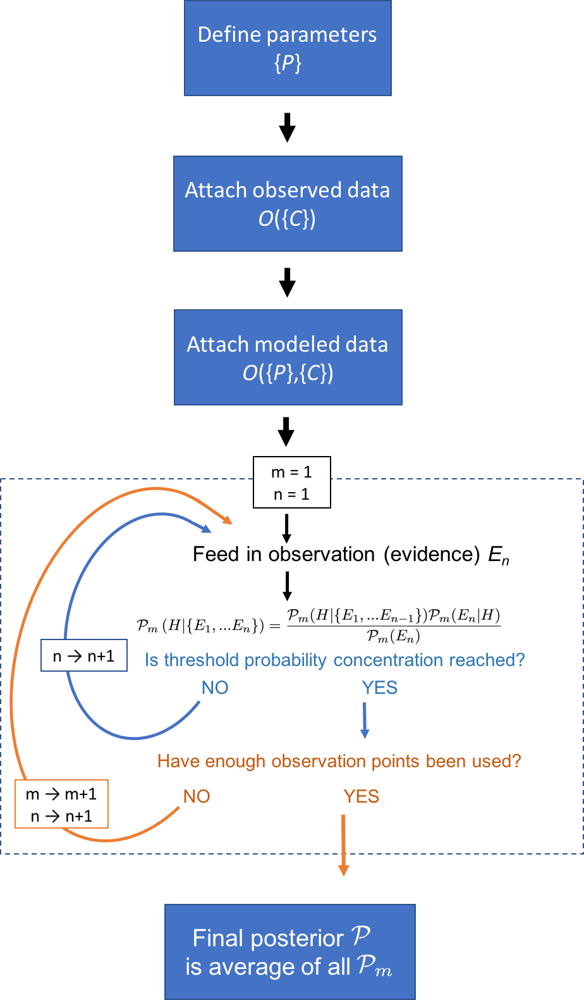

Manual
======

.. toctree::
   :hidden:

Overview
--------
The basic procedure of performing a parameter fit with ``bayesim`` is as follows:

template text for documenting commandline stuff:

-a            command-line option "a"
-b file       options can have arguments
              and long descriptions
--long        options can be long also
--input=file  long options can also have
              arguments
/V            DOS/VMS-style options too
